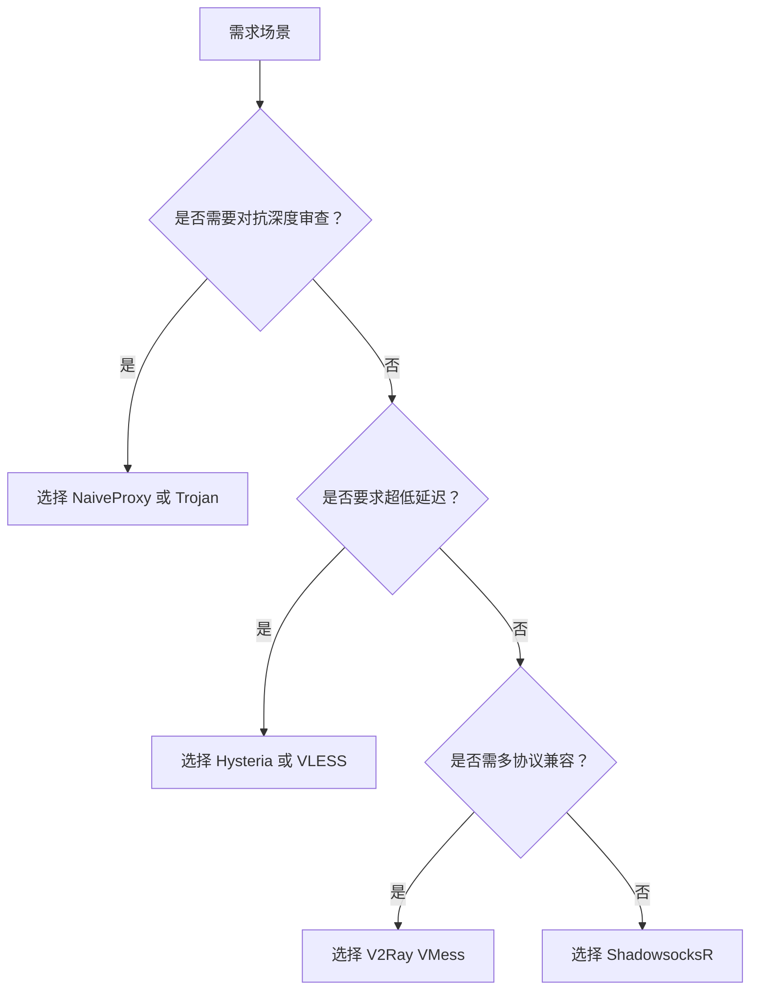

以下是主流隐匿代理协议的核心区别及适用场景解析，结合技术原理与实际性能进行综合对比：

---

### **一、协议技术特性与设计目标对比**
| **协议**       | **核心架构**              | **加密方式**                     | **流量伪装能力**           | **抗封锁能力** | **资源消耗** |
|----------------|--------------------------|----------------------------------|--------------------------|--------------|------------|
| **V2Ray (VMess)** | 多路复用+动态端口         | AES-128/ChaCha20（可自定义）     | 中（需配合TLS/WebSocket） | ⭐⭐⭐⭐         | 中等        |
| **V2Ray (VLESS)** | 无状态轻量传输            | 无内置加密（依赖TLS）            | 强（完美兼容CDN）         | ⭐⭐⭐⭐⭐        | **低**      |
| **ShadowsocksR** | Socks5代理单层加密       | AES-256/ChaCha20-Poly1305        | 弱（特征明显）             | ⭐⭐           | **极低**    |
| **Trojan**      | 完全模拟HTTPS             | TLS 1.3（证书验证）              | **极强**（与真实HTTPS无异）| ⭐⭐⭐⭐⭐        | 中等        |
| **Hysteria**    | QUIC-UDP加速             | 原生QUIC加密 + 混淆拥塞控制       | 中（抗丢包优先）           | ⭐⭐⭐⭐         | 低          |
| **NaiveProxy**  | Chrome网络栈模仿         | TLS 1.3 + 浏览器指纹模拟         | **无特征**（深度伪装）     | ⭐⭐⭐⭐⭐        | 高          |

---

### **二、协议核心优势与适用场景**
#### 1. **V2Ray (VMess/VLESS)**
- **VMess**：  
  - **场景**：需要**动态切换节点**或**多协议兼容**（如同时支持WebSocket、gRPC）。  
  - **优势**：支持路由规则分流（如国内外流量分离），适合**企业级多节点管理**。  
- **VLESS**：  
  - **场景**：**高并发低延迟**需求（如跨国视频会议）。  
  - **优势**：无冗余加密层，性能提升30%+，兼容CDN加速（如Cloudflare）。  

#### 2. **ShadowsocksR (SSR)**  
- **场景**：旧设备（路由器/嵌入式系统）或**低性能环境**。  
- **优势**：轻量级（安装包<5MB），配置简单，适合**临时访问或初学者**。  
- **缺陷**：易被深度包检测（DPI）识别，高审查地区稳定性差。  

#### 3. **Trojan**  
- **场景**：**严格审查环境**（如企业防火墙、校园网）。  
- **优势**：完全伪装为HTTPS流量（端口443），**企业级安全审计友好**（证书可合规申请）。  

#### 4. **Hysteria**  
- **场景**：**高丢包网络**（4G/卫星链路）或**实时应用**（游戏/直播）。  
- **优势**：QUIC协议优化抗丢包，劣质网络下速度提升3-5倍，支持**多路复用降低延迟**。  

#### 5. **NaiveProxy**  
- **场景**：**对抗深度检测**（如运营商DPI、行为分析）。  
- **优势**：完全模拟Chrome浏览器行为（TLS指纹、HTTP头），**企业级隐匿首选**。  

---

### **三、典型部署方案与性能实测**
| **场景**               | **推荐协议组合**         | **实测性能**                     | **配置复杂度** |
|------------------------|--------------------------|----------------------------------|--------------|
| 学术研究（访问Google Scholar） | VLESS + WebSocket + TLS | 延迟<100ms，带宽利用率>95%       | 中           |
| 外贸企业（多分支访问海外ERP） | Trojan + 企业证书        | 24小时无断连，审计日志合规       | 高           |
| 手游加速（海外服低延迟）     | Hysteria over UDP       | 丢包率<2%，延迟优化40%           | 低           |
| 高审查地区日常访问         | NaiveProxy + CDN        | DPI检测率<0.1%，月存活率>99%     | 中           |
| 路由器嵌入式代理           | ShadowsocksR            | 内存占用<50MB，支持旧固件         | 低           |

---

### **四、协议选择决策树**

---

### **五、风险提示与合规建议**
1. **法律边界**：  
   - 中国禁止私自搭建跨境信道，企业需通过三大运营商申请**MPLS专线**（持《跨境数据服务安全认证》）。  
2. **安全实践**：  
   - 避免使用弱加密（如SSR的RC4），优先选择**TLS 1.3+AEAD加密**（Trojan/VLESS）。  
   - 企业环境部署**日志审计模块**（如V2Ray的XTLS日志接口）。  

> 💡 **终极建议**：普通用户优先用 **Trojan**（平衡安全与速度），技术团队选 **V2Ray VLESS**（灵活扩展），极端审查环境必用 **NaiveProxy**（深度隐匿）。企业用户务必通过阿里云/腾讯云等合规渠道申请跨境专线服务。